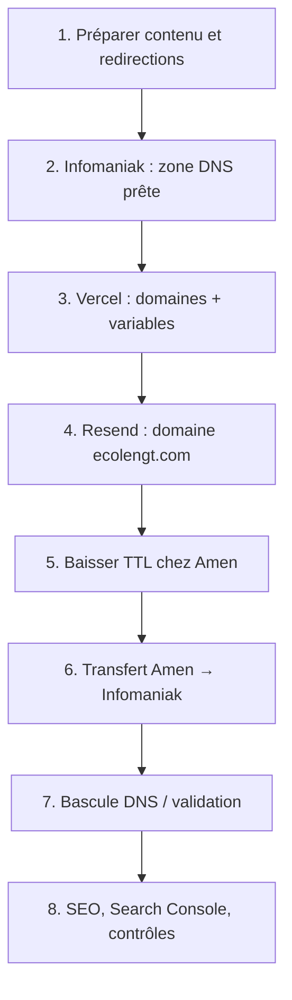

# Checklist de mise en ligne — École de Batterie NGT

Ce document regroupe **toutes** les actions à mener pour la sortie du nouveau site (hors code), dans l’ordre le plus sûr pour limiter les interruptions et les erreurs.

**Contexte** : le nouveau site **remplace entièrement** l’ancien site public. L’ancien site (~15 ans, créé avec un outil Apple type **iWeb**) est hébergé chez un hébergeur classique ; les noms de domaine sont aujourd’hui chez **Amen** et seront migrés chez **Infomaniak**. Le site tourne sur **Vercel** avec **Payload CMS**, **MongoDB Atlas**, **Vercel Blob** et **Resend** pour les e-mails.

---

## Domaines retenus

| Domaine                           | Rôle                              | Action                                                                                                          |
| --------------------------------- | --------------------------------- | --------------------------------------------------------------------------------------------------------------- |
| **ecolengt.com**                  | Domaine **principal** (canonique) | Site en production                                                                                              |
| **ecolengt.fr**                   | Domaine secondaire                | **Redirection 301** vers `https://ecolengt.com` (toutes les URLs)                                               |
| **stagedebatterie.com** et autres | Anciens domaines                  | **Abandon** — ne pas renouveler ; mettre à jour les liens externes vers `https://ecolengt.com/stages-intensifs` |

**Décisions figées pour la prod** :

- URL canonique : **`https://ecolengt.com`** (sans `www`, sauf si vous choisissez explicitement `www` — voir section 5 ; une seule variante, jamais les deux).
- E-mails **automatiques du site** (reset admin) : **`no-reply@ecolengt.com`** via **Resend** — ce n’est **pas** une boîte mail à consulter (section 6).
- **Aucune boîte mail** `@ecolengt.com` / `@ecolengt.fr` : pas de MX Infomaniak à configurer pour la mise en ligne.
- Variable `NEXT_PUBLIC_SERVER_URL` : **`https://ecolengt.com`** (sans slash final).

---

## Vue d’ensemble — ordre recommandé



| Étape                                       | Quand      | Durée indicative            |
| ------------------------------------------- | ---------- | --------------------------- |
| Préparation (redirections, contenu, env)    | J-14 à J-7 | 2–5 h                       |
| DNS copié chez Infomaniak + domaines Vercel | J-7 à J-3  | 1–2 h                       |
| Resend + test e-mail                        | J-7 à J-1  | 30 min + propagation DNS    |
| Baisser TTL                                 | J-2        | 5 min (+ 24 h d’attente)    |
| Transfert registrar / changement NS         | Jour J     | 15 min à 48 h (propagation) |
| Contrôles post-bascule                      | J à J+7    | 1 h                         |
| Suivi SEO                                   | J+7 à J+30 | 15 min / semaine            |

---

## 1. Préparer la migration depuis l’ancien site

À faire **avant** la bascule DNS, idéalement **2 semaines avant**.

### 1.1 Inventorier les URLs de l’ancien site

L’ancien outil Apple ne fournit pas d’export fiable. Recoupez plusieurs sources :

1. **Navigation manuelle** sur l’ancien site encore en ligne : menu, pied de page, chaque page importante ; notez le chemin exact (`/Contact.html`, `/Accueil.html`, etc.).
2. **Google** : `site:ecolengt.com` et `site:ecolengt.fr` → URLs encore indexées.
3. **[Internet Archive](https://web.archive.org/)** : captures historiques du domaine.
4. **Liens externes** : site Dante Agostini, annuaires, réseaux sociaux, QR codes, favoris.
5. **stagedebatterie.com** (si encore actif) : `site:stagedebatterie.com` — uniquement pour savoir quels liens mettre à jour ; le domaine sera **abandonné**, pas redirigé depuis Vercel.

**À ignorer en priorité** : vieux `/sitemap.xml`, pages test, galeries sans trafic.

Pour chaque URL **utile** (Google, partenaire, partage récurrent), notez : chemin exact → équivalent sur le nouveau site, ou « rediriger vers `/` ».

### 1.2 Table de correspondance et redirections 301

Chaque ancienne URL qui ne correspond **pas** au même chemin sur le nouveau site doit avoir une **redirection 301** dans `next.config.ts` (section `redirects`), puis un **redéploiement Vercel**.

| Ancienne URL (exemples iWeb)        | Nouvelle URL                        |
| ----------------------------------- | ----------------------------------- |
| `/`, `/index.html`, `/Accueil.html` | `/`                                 |
| `/Contact.html`, `/contact.html`    | `/contact`                          |
| Page stages / tarifs `.html`        | `/stages-intensifs` ou `/tarifs`    |
| Ancienne actualités                 | `/actualite` ou `/actualite/[slug]` |
| _À compléter après inventaire_      | …                                   |

**Pages du nouveau site** (référence) :

| Chemin                         | Contenu             |
| ------------------------------ | ------------------- |
| `/`                            | Accueil             |
| `/contact`                     | Contact             |
| `/actualite`                   | Actualités          |
| `/actualite/[slug]`            | Article             |
| `/livre-dor`                   | Livre d’or          |
| `/anciens-eleves`              | Anciens élèves      |
| `/eleves/[slug]`               | Fiche élève         |
| `/tom-tom`                     | Association Tom Tom |
| `/stages-intensifs`            | Stages intensifs    |
| `/stages-intensifs/calendrier` | Calendrier stages   |
| `/tarifs`                      | Tarifs              |
| `/mentions-legales`            | Mentions légales    |

Redirection déjà en place dans le code : `/stages-intensifs/tarifs` → `/tarifs#stages-intensifs`.

**À transmettre au développeur** : un tableau `ancienne URL → nouvelle URL` (même 5–15 lignes suffisent souvent). Sans ces 301, favoris et liens Google afficheront des **404** pendant des mois.

### 1.3 Abandon de stagedebatterie.com et autres domaines

1. **Ne pas** ajouter `stagedebatterie.com` sur Vercel.
2. **Mettre à jour** tous les liens que vous contrôlez (Dante Agostini, réseaux sociaux, annuaires, signatures e-mail) vers **`https://ecolengt.com/stages-intensifs`**.
3. **Ne pas renouveler** le domaine à l’échéance (ou le laisser expirer après migration).
4. Si le domaine est encore actif au moment de la mise en ligne et que vous recevez du trafic : une **seule** redirection 301 au niveau du registrar (Amen) vers `https://ecolengt.com/stages-intensifs` le temps de la transition est acceptable — ce n’est **pas** une infrastructure à maintenir sur Vercel.

---

## 2. Migration registrar Amen → Infomaniak (sans interruption)

Objectif : le site reste accessible pendant et après le changement ; coupure maximale typique **0 à 5 minutes** si la procédure est respectée.

### 2.1 Avant toute modification — inventaire Amen

Dans le manager **Amen**, pour **ecolengt.com** et **ecolengt.fr** :

1. Exportez ou recopiez **tous** les enregistrements DNS (A, AAAA, CNAME, MX, TXT, SRV…).
2. Notez les **serveurs de noms** actuels.
3. Repérez ce qui sert encore :
   - site web actuel (à remplacer par Vercel) ;
   - enregistrements **TXT** (Search Console, ancien SPF éventuel…) ;
   - **MX** : normalement **aucun** pour ce projet — il n’y a pas de boîtes `@ecolengt.com` / `@ecolengt.fr`. Si Amen listait des MX obsolètes, vous pourrez les **supprimer** après bascule (ne pas les recréer chez Infomaniak).

**Ne supprimez rien chez Amen tant que la bascule n’est pas validée.**

### 2.2 Transférer avant la fin de l’abonnement Amen

Si vos noms de domaine sont payés chez Amen **jusqu’à une date ultérieure** (ex. février 2027) mais que vous transférez vers Infomaniak **plus tôt** (ex. août 2026) :

**Le nom de domaine — vous ne perdez pas les mois déjà payés**

- Lors d’un transfert, Infomaniak facture en général **un an** de renouvellement.
- Cette année s’**ajoute** à la date d’expiration actuelle (règle ICANN) : le crédit restant chez Amen **reste sur le domaine**.
- Exemple : expiration février 2027, transfert août 2026 → après transfert, expiration probable **vers février 2028** (≈ 6 mois restants + 1 an).
- Amen **n’est plus registrar** une fois le transfert terminé (5–7 jours) ; le renouvellement de 2027 se fera chez **Infomaniak**, pas Amen.

**L’abonnement Amen — à distinguer du domaine**

Dans le manager Amen, vérifiez si votre contrat jusqu’en février 2027 inclut :

| Élément                                      | Après transfert du domaine                                                                                                                                                               |
| -------------------------------------------- | ---------------------------------------------------------------------------------------------------------------------------------------------------------------------------------------- |
| **Enregistrement** `.com` / `.fr`            | Géré par Infomaniak ; plus de renouvellement domaine chez Amen.                                                                                                                          |
| **Hébergement web** (ancien site iWeb, FTP…) | Peut rester **actif et facturé** chez Amen jusqu’à la fin du contrat si vous ne **résiliez** pas — souvent **sans remboursement** du prorata. Inutile dès que le DNS pointe vers Vercel. |

**Calendrier conseillé** : rien n’oblige à attendre février 2027. Vous pouvez transférer dès que le nouveau site est prêt, puis **résilier l’hébergement Amen** après validation (section 2.7), même si un abonnement Amen court encore quelques mois.

**Points de vigilance** : domaine **déverrouillé**, code **AUTH/EPP** ; éviter un transfert dans les **15 jours** avant expiration ; **deux transferts** distincts pour `.com` et `.fr`.

### 2.3 Créer la zone DNS chez Infomaniak (avant le transfert)

1. Compte [Infomaniak](https://www.infomaniak.com) → **Nom de domaine** → **Transférer un domaine** (ou **Ajouter** si vous ne transférez que la gestion DNS au début).
2. Pour **ecolengt.com** et **ecolengt.fr** : lancez le **transfert** depuis Amen (code AUTH / EPP, domaine **déverrouillé**, WHOIS à jour). Le transfert peut prendre **5 à 7 jours** ; le site reste en ligne si le DNS n’est pas cassé.
3. Dans Infomaniak → **DNS** pour chaque domaine, recréez les **TXT** utiles (Search Console, etc.). **Pas de MX** sauf si vous souscrivez plus tard une messagerie Infomaniak payante (section 6.3).
4. **Ne pointez pas encore** le site vers Vercel sur la zone Infomaniak si Amen sert encore le trafic — voir section 2.5 (stratégie sans coupure).

### 2.4 Baisser le TTL (obligatoire pour bascule rapide)

**48 h minimum avant** le changement de NS ou de records web :

1. Chez le gestionnaire DNS **actif** (Amen ou Infomaniak selon l’étape), passez le TTL des enregistrements `@` et `www` à **300 secondes** (5 min).
2. Attendez **24–48 h** que l’ancien TTL expire partout.

Sans cette étape, la propagation peut prendre **24–48 h** au lieu de quelques minutes.

### 2.5 Stratégie zéro interruption (recommandée)

**Phase A — Pendant que Amen sert encore le site**

1. Ajoutez **ecolengt.com** (et `www`) dans **Vercel** (section 3) — Vercel affiche les enregistrements DNS requis.
2. **Ne changez pas** encore les A/CNAME chez Amen si l’ancien site doit rester visible.
3. Testez le nouveau site sur l’URL Vercel (`*.vercel.app`) : admin, pages, uploads, e-mail de test (section 6).

**Phase B — Pré-validation DNS (optionnelle, sans couper l’ancien site)**

Sur votre machine, testez la résolution future :

```bash
# Remplacez par les valeurs Vercel affichées dans le dashboard
dig @ns1.vercel-dns.com ecolengt.com
```

Ou modifiez temporairement le fichier `hosts` local pour pointer vers Vercel et valider le site **sans** impacter le public.

**Phase C — Bascule web (instantanée si TTL bas)**

Quand le nouveau site est prêt et validé :

1. Chez le gestionnaire DNS **authoritatif** (Infomaniak une fois le transfert terminé, ou Amen en attendant) :
   - **Apex `@`** → `76.76.21.21` (Vercel)
   - **`www`** → `cname.vercel-dns.com` (CNAME)
2. Conservez les **TXT** Resend et Search Console ; ajoutez les enregistrements Resend (section 6.1).
3. Attendez la propagation (5–30 min avec TTL 300).
4. Vérifiez : `https://ecolengt.com` affiche le **nouveau** site, certificat SSL valide, pas la page Amen / iWeb.

**Phase D — Transfert registrar**

- Si le transfert Amen → Infomaniak est **en cours** : les DNS Infomaniak doivent déjà être identiques à ce que vous aviez préparé ; après transfert, vérifiez que les **serveurs de noms Infomaniak** sont bien actifs.
- Si vous ne transférez que plus tard : vous pouvez d’abord ne changer que les **records** chez Amen, puis transférer le domaine ensuite (le site reste sur Vercel).

### 2.6 ecolengt.fr sur Infomaniak

Même procédure que `.com` :

1. Transfert ou gestion DNS chez Infomaniak.
2. Enregistrements DNS identiques à ce que **Vercel** demande pour `ecolengt.fr` (A + CNAME `www`).
3. La **redirection** `.fr` → `.com` se configure dans **Vercel** (section 3.4), pas dans Infomaniak seul.

### 2.7 Après la bascule

1. Désactivez l’**ancien hébergement web** Amen (FTP / hébergement mutualisé) — **seulement** après validation du nouveau site.
2. Supprimez les enregistrements DNS obsolètes pointant vers l’ancien serveur.
3. Gardez Infomaniak comme **registrar + DNS** unique pour `.com` et `.fr`.

---

## 3. Lier les domaines à Vercel

Référence technique : [DEPLOYMENT.md](./DEPLOYMENT.md).

### 3.1 Projet Vercel

1. Projet déployé depuis GitHub (`aurelien-robineau/ecolengt` ou équivalent).
2. **Storage** → **Blob** activé (`BLOB_READ_WRITE_TOKEN` injecté automatiquement).
3. Variables d’environnement **Production** (section 4) renseignées **avant** le jour J.

### 3.2 Ajouter ecolengt.com (domaine principal)

1. Vercel → projet → **Settings** → **Domains**.
2. **Add** → `ecolengt.com`.
3. **Add** → `www.ecolengt.com`.
4. Vercel affiche les enregistrements à créer chez Infomaniak :

   | Type  | Nom   | Valeur                 |
   | ----- | ----- | ---------------------- |
   | A     | `@`   | `76.76.21.21`          |
   | CNAME | `www` | `cname.vercel-dns.com` |

5. Attendez le statut **Valid** / certificat SSL **Ready** (vert).
6. Définissez **`ecolengt.com`** comme domaine **primary** (sans www, sauf choix contraire documenté en section 5 — URL canonique).

### 3.3 Redirection www ↔ apex

Dans **Domains** :

- Domaine primary : **`ecolengt.com`**
- **`www.ecolengt.com`** : **Redirect to** → `https://ecolengt.com` (301)

(Inverse possible si vous préférez `www` — mais alors mettez **`https://www.ecolengt.com`** partout : `NEXT_PUBLIC_SERVER_URL`, canonical, Resend, Search Console.)

### 3.4 Ajouter ecolengt.fr (redirection vers .com)

1. **Add** → `ecolengt.fr` et `www.ecolengt.fr`.
2. DNS Infomaniak pour **ecolengt.fr** :

   | Type  | Nom   | Valeur                 |
   | ----- | ----- | ---------------------- |
   | A     | `@`   | `76.76.21.21`          |
   | CNAME | `www` | `cname.vercel-dns.com` |

3. Dans Vercel, pour **`ecolengt.fr`** et **`www.ecolengt.fr`** : **Redirect to** → `https://ecolengt.com` (301, conserver le chemin — ex. `ecolengt.fr/contact` → `ecolengt.com/contact`).

Vercel gère le certificat SSL pour les deux domaines.

### 3.5 Vérifications domaines Vercel

| Test                       | Résultat attendu             |
| -------------------------- | ---------------------------- |
| `https://ecolengt.com`     | Nouveau site, SSL OK         |
| `https://www.ecolengt.com` | 301 → `https://ecolengt.com` |
| `https://ecolengt.fr`      | 301 → `https://ecolengt.com` |
| `https://www.ecolengt.fr`  | 301 → `https://ecolengt.com` |
| `http://ecolengt.com`      | Redirection HTTPS            |

---

## 4. Variables d’environnement Vercel (Production)

**Settings** → **Environment Variables** :

| Variable                 | Valeur Production       | Notes                   |
| ------------------------ | ----------------------- | ----------------------- |
| `DATABASE_URL`           | URI MongoDB Atlas       | Cluster M0 minimum      |
| `PAYLOAD_SECRET`         | `openssl rand -hex 32`  | Long, aléatoire, stable |
| `NEXT_PUBLIC_SERVER_URL` | `https://ecolengt.com`  | Sans slash final        |
| `RESEND_API_KEY`         | Clé API Resend          | Section 6               |
| `EMAIL_FROM_ADDRESS`     | `no-reply@ecolengt.com` | Domaine vérifié Resend  |
| `EMAIL_FROM_NAME`        | `École de Batterie NGT` | Libellé expéditeur      |
| `BLOB_READ_WRITE_TOKEN`  | (auto)                  | Via Vercel Blob         |

**Après toute modification** : **Redeploy** du projet Production.

**Vérification canonical** : code source de la home → `canonical` et JSON-LD doivent utiliser `https://ecolengt.com`, jamais `localhost` ni `*.vercel.app` une fois le domaine attaché.

---

## 5. URL canonique — choix www ou sans www

**Recommandation** : **`https://ecolengt.com`** (sans www), cohérent avec `.env.example`.

1. Une **seule** variante canonique pour Google, Open Graph, sitemap, `llms.txt`.
2. L’autre variante redirige en **301**.
3. `NEXT_PUBLIC_SERVER_URL` = exactement cette URL (protocole `https` inclus).
4. **Ne changez pas** www ↔ sans www le jour J si l’ancien site utilisait déjà une variante indexée — alignez-vous sur ce que Google affiche dans Search Console.

---

## 6. E-mail — Resend (site) vs messagerie Infomaniak (boîtes)

### 6.0 Pas de boîte mail sur le nom de domaine

**Situation actuelle** : aucune adresse du type `contact@ecolengt.com` ou `secretariat@ecolengt.fr` — et **c’est suffisant** pour la mise en ligne du site.

| Besoin                                | Solution                                                                                  | Coût                                                                                  |
| ------------------------------------- | ----------------------------------------------------------------------------------------- | ------------------------------------------------------------------------------------- |
| Reset mot de passe admin Payload      | **Resend** + `no-reply@ecolengt.com`                                                      | Gratuit jusqu’au quota Resend (100 e-mails/jour en free tier) ; pas de boîte à ouvrir |
| E-mail de contact affiché sur le site | Adresse perso existante (Gmail, Orange, etc.) renseignée dans **Payload → Site settings** | Selon votre fournisseur actuel                                                        |
| Boîte professionnelle `@ecolengt.com` | **Infomaniak Service Mail** ou **kSuite**                                                 | **Payant** — pas inclus avec le seul enregistrement du domaine                        |

**Infomaniak « mail gratuit »** ([my kSuite](https://www.infomaniak.com/fr/email-gratuit)) = une adresse **@ik.me**, **@ikmail.com** ou **@etik.com** — **pas** `@ecolengt.com`. Pour une adresse sur **votre** domaine, il faut une offre mail payante (à partir d’environ **2,29 CHF/mois** pour Service Mail, voir [tarifs Infomaniak](https://www.infomaniak.com/fr/ksuite/service-mail)).

**Conséquence pour la migration DNS** : vous n’avez **pas** à configurer de records **MX** chez Infomaniak pour la mise en ligne. Seuls les **TXT** (et parfois un **MX** technique) de **Resend** sont nécessaires pour **envoyer** depuis `no-reply@ecolengt.com`.

---

### 6.1 Vérifier ecolengt.com sur Resend

1. [Resend](https://resend.com) → **Domains** → **Add domain** → `ecolengt.com`.
2. Copiez les enregistrements DNS proposés (SPF, DKIM — en général des **TXT** ; Resend peut aussi demander un **MX** dédié à l’**envoi**, ce n’est **pas** une boîte mail Infomaniak).
3. Ajoutez-les dans la zone DNS **Infomaniak** de `ecolengt.com`.
4. Attendez **Valid** dans Resend (quelques minutes à quelques heures).
5. S’il restait un ancien TXT SPF chez Amen, fusionnez ou remplacez-le au moment de la bascule — inutile si aucun mail n’était configuré sur le domaine.

### 6.2 Variables Vercel et test

1. Renseignez `RESEND_API_KEY`, `EMAIL_FROM_ADDRESS`, `EMAIL_FROM_NAME` (section 4).
2. Redéployez.
3. Test : `/admin` → mot de passe oublié → l’e-mail arrive depuis `no-reply@ecolengt.com`.

Tant que le domaine n’est pas **Valid** sur Resend, considérez la récupération de compte admin comme **non fiable** en production.

### 6.3 Si vous voulez plus tard une vraie boîte `@ecolengt.com`

Optionnel, **après** la mise en ligne :

1. Infomaniak → commander **Service Mail** ou **kSuite** sur `ecolengt.com`.
2. Infomaniak configure alors les **MX** ; Resend (TXT/MX d’envoi) reste compatible — vérifier la doc Resend + Infomaniak si SPF doit fusionner plusieurs sources.
3. Mettre à jour l’e-mail de contact dans Payload si vous passez de Gmail perso à `contact@ecolengt.com`.

**Ce n’est pas requis** pour publier le site ni pour le reset admin (Resend seul suffit).

---

## 7. Contenu Payload CMS (avant et après mise en ligne)

Le JSON-LD et les textes dynamiques utilisent le global **Site settings** :

| Champ                   | Importance               |
| ----------------------- | ------------------------ |
| Nom court de l’école    | Titres, schema `WebSite` |
| Adresse Aix-en-Provence | SEO local                |
| Téléphone, e-mail       | Confiance / rich results |
| Adresse stages (Razès)  | Stages intensifs         |
| Instagram / Facebook    | `sameAs` JSON-LD         |
| Année de fondation      | `foundingDate`           |

Reprenez depuis l’ancien site les infos **factuelles** (adresses, horaires, tarifs stages). Vérifiez ville Razès, code postal, liens Google Maps.

**Médias** : les fichiers locaux ne migrent pas automatiquement — re-uploadez via l’admin après activation de Vercel Blob.

**Premier admin** : créez le compte sur `/admin` dès que la prod est accessible.

---

## 8. Jour J — bascule

Checklist le jour de la mise en production :

- [ ] TTL à 300 s actif depuis 48 h
- [ ] Enregistrements A / CNAME Vercel en place chez Infomaniak (ou Amen si transfert non terminé)
- [ ] Domaines **Valid** dans Vercel (SSL vert)
- [ ] Redirections `www` et `.fr` testées
- [ ] `NEXT_PUBLIC_SERVER_URL` = `https://ecolengt.com`
- [ ] Resend domaine **Valid**
- [ ] Redirections 301 anciennes URLs iWeb déployées (`next.config.ts`)
- [ ] Bascule DNS web (section 2.5 phase C)
- [ ] Navigation privée : home, contact, stages, `/admin`, une ancienne URL connue
- [ ] Pas de `robots.txt` en `Disallow: /` sur la prod
- [ ] Ancien hébergement web coupé **après** validation (pas avant)

---

## 9. SEO et référencement (après mise en ligne)

Le code inclut déjà métadonnées, JSON-LD, `sitemap.xml`, `robots.txt`, `public/llms.txt`. Actions **éditeur / propriétaire** :

### 9.1 Google Search Console

1. Propriété pour **`ecolengt.com`** (idéalement **préfixe d’URL** `https://ecolengt.com` ou **domaine** si TXT DNS).
2. Propriété séparée pour **`ecolengt.fr`** (optionnel — surveiller les redirections).
3. Soumettre : `https://ecolengt.com/sitemap.xml`
4. **Inspection d’URL** : home, `/stages-intensifs`, `/contact`.
5. Surveiller **Pages** / **Couverture** : 404 sur anciennes URLs → compléter le tableau section 1.2.

Pas d’outil « changement d’adresse » si le domaine principal reste `.com`.

### 9.2 Bing Webmaster Tools

1. [Bing Webmaster](https://www.bing.com/webmasters) — import possible depuis Google.
2. Sitemap : `https://ecolengt.com/sitemap.xml`

### 9.3 Fichier llms.txt (GEO)

1. Vérifier : `https://ecolengt.com/llms.txt`
2. Si besoin, mettre à jour `public/llms.txt` (domaine `.com`) puis redéployer.

### 9.4 Contrôles techniques rapides

| URL                      | Attendu                                                                     |
| ------------------------ | --------------------------------------------------------------------------- |
| `/robots.txt`            | `Allow: /`, `Sitemap: https://ecolengt.com/sitemap.xml`, `Disallow: /admin` |
| `/sitemap.xml`           | Pages + articles + fiches élèves                                            |
| Home (source)            | JSON-LD `MusicSchool`, Dante Agostini, Razès                                |
| Ancienne URL iWeb testée | 301 ou 200 — pas de 404                                                     |
| `ecolengt.fr/contact`    | 301 → `ecolengt.com/contact`                                                |

**Outils** :

- [Google Rich Results Test](https://search.google.com/test/rich-results)
- [Schema Markup Validator](https://validator.schema.org/)

### 9.5 Contenu éditorial (impact fort)

- **Actualités** : articles avec vocabulaire naturel (stage, NGT, Aix, adultes…).
- **Stages intensifs** : intro claire (dates, public, Razès, Dante Agostini).
- **Anciens élèves** : fiches complètes (sitemap).

### 9.6 Méthode Dante Agostini

- Formulation : enseignement **selon** la méthode Dante Agostini — pas « affiliée au réseau ».
- Mettre à jour fiches Dante Agostini, Google Business, réseaux sociaux : URL **`https://ecolengt.com/stages-intensifs`** (plus stagedebatterie.com).
- Cohérence : « École de Batterie NGT », « stages à Razès ».

### 9.7 Suivi mensuel (~15 min)

1. Search Console : impressions / clics « batterie », « Aix », « stage ».
2. Erreurs couverture ou données structurées.
3. 404 persistants → nouvelles lignes dans le tableau de redirections.

Un léger flottement SEO **2–6 semaines** est normal après refonte ; sur un ancien site iWeb peu indexé, l’impact initial est souvent faible.

---

## 10. Ce qui est déjà fait dans le code

- Métadonnées (title, description, OG, Twitter, canonical)
- JSON-LD global (`MusicSchool`, centre stages, `WebSite`)
- `sitemap.xml` et `robots.txt` (Next.js)
- `public/llms.txt`
- Redirection : `/stages-intensifs/tarifs` → `/tarifs#stages-intensifs`

**À ajouter par le développeur** : redirections 301 depuis l’inventaire section 1.2 dans `next.config.ts`.

**Hors scope code** : transfert Amen → Infomaniak, domaines Vercel, Resend, Search Console, mise à jour des liens stagedebatterie.com.

---

## 11. Dépannage rapide

| Problème                          | Piste                                                                            |
| --------------------------------- | -------------------------------------------------------------------------------- |
| Site affiche encore l’ancien iWeb | DNS pointe encore vers Amen / ancien IP ; vider cache DNS local ; vérifier A `@` |
| SSL « non sécurisé » sur Vercel   | Domaine pas **Valid** ; attendre émission certificat (jusqu’à 24 h)              |
| Canonical en `*.vercel.app`       | `NEXT_PUBLIC_SERVER_URL` incorrect ou redeploy manquant                          |
| E-mail reset admin absent         | Resend domaine non validé ; SPF/DKIM ; spam                                      |
| Upload média échoue               | Vercel Blob non activé ; redeploy après Blob                                     |
| `.fr` ne redirige pas             | Redirection configurée dans Vercel Domains, pas seulement DNS                    |
| Coupure longue après bascule      | TTL pas baissé avant ; propagation jusqu’à 48 h                                  |

---

## Contacts et livrables développeur

Transmettre au développeur **avant** le jour J :

1. Tableau **ancienne URL → nouvelle URL** (domaine principal).
2. Confirmation du choix **canonique** (`https://ecolengt.com` ou `www`).
3. Liste des domaines **abandonnés** (stagedebatterie.com, etc.).

Questions ou URLs anciennes à mapper : compléter section 1.2 et planifier un redéploiement Vercel.
